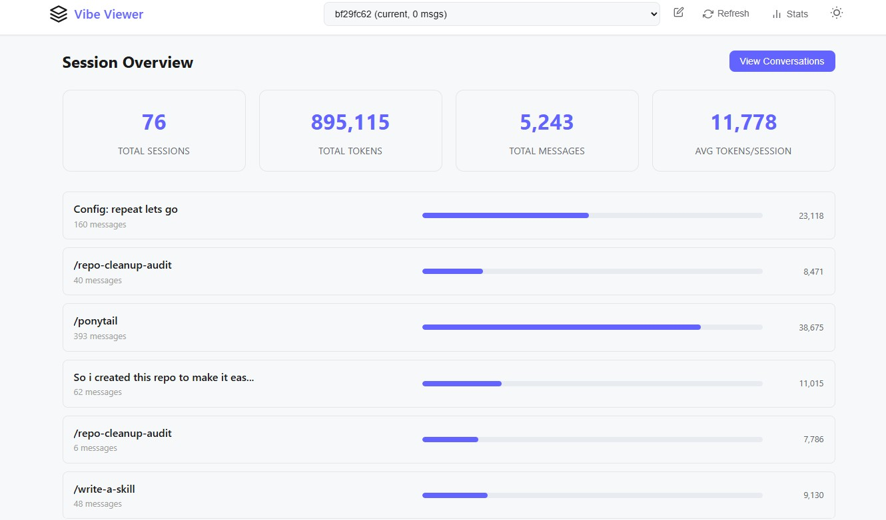

# V_V

### vibe-viewer

[](https://www.python.org/downloads/)
[](https://opensource.org/licenses/MIT)

A lightweight web viewer for Mistral Vibe CLI conversations. View your chat history in a browser with better readability, session navigation, and theme support.

## Features

- **Manual Refresh**: Control when to update conversations - no auto-refreshing
- **Session Browser**: Navigate between all your Vibe conversation sessions
- **Beautiful Markdown Rendering**: Messages displayed with proper formatting
- **Dark/Light Theme**: Toggle between themes for comfortable viewing
- **Responsive Design**: Works on desktop and mobile devices
- **Minimal Setup**: Single command to start, no configuration required

## Screenshot

This is how it looks like:



## Installation

### From PyPI (coming soon)

```bash
pip install vibe-viewer
```

### From GitHub

```bash
pip install git+https://github.com/tzuV/Vibe_Viewer.git
```

### Development (editable mode)

```bash
# Clone the repository
git clone https://github.com/tzuV/Vibe_Viewer.git
cd Vibe_Viewer

# Install in development mode
pip install -e .
```

## Usage

### Start the viewer

```bash
vibe-viewer
```

This will:
- Start a local web server on port 5000
- Open your default browser to http://localhost:5000
- Display your current Vibe session

### Command line options

```bash
# Use a custom port
vibe-viewer --port 8080
vibe-viewer -p 8080

# Bind to a specific host
vibe-viewer --host 0.0.0.0

# View a specific session
vibe-viewer --session SESSION_ID

# List all available sessions
vibe-viewer --list
vibe-viewer -l

# Disable automatic browser opening
vibe-viewer --no-browser

# Combine options
vibe-viewer -p 8080 -H 0.0.0.0 --no-browser
```

### In the browser

- **Refresh**: Click the refresh button to reload current session messages
- **Session Browser**: Click the session name to see all available sessions
- **Theme Toggle**: Use the theme switcher to change between dark and light modes
- **Navigation**: Messages are displayed in chronological order

## How it works

vibe-viewer reads conversation data from your Vibe CLI's log directory (typically `~/.vibe/logs/session/`). It serves this data through a simple HTTP server and provides a clean web interface to browse and view your conversations.

### Data location

The viewer reads from:
- Session metadata: `~/.vibe/logs/session/{session_id}/meta.json`
- Messages: `~/.vibe/logs/session/{session_id}/messages.jsonl`

No data is modified or written - vibe-viewer is read-only.

## Project Structure

```
vibe-viewer/
├── vibe_viewer/
│   ├── __init__.py       # Package initialization
│   ├── __main__.py       # Main application entry point
│   └── templates/
│       └── index.html    # Web interface template
├── pyproject.toml        # Build configuration
├── README.md             # This file
└── LICENSE               # MIT License
```

## Requirements

- Python 3.8 or higher
- Mistral Vibe CLI (for the conversation data)

## Contributing

Contributions are welcome! Please feel free to submit issues or pull requests.

## License

This project is licensed under the MIT License - see the [LICENSE](LICENSE) file for details.
